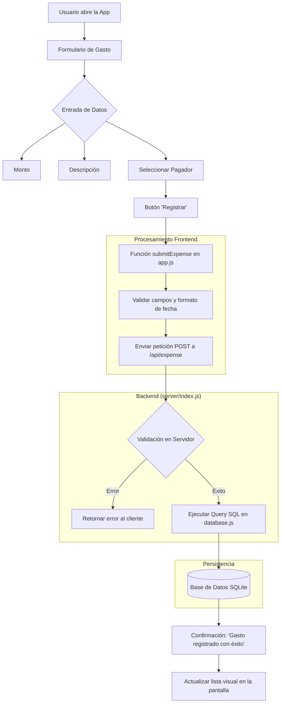

# Diagrama de Flujo del Registro de Gastos

Este documento describe el flujo de datos y la lógica para registrar un nuevo gasto en la aplicación "Reloj".

## Diagrama de Flujo (Mermaid)

## Descripción del Flujo Detallado

1.  **Interfaz de Usuario (UI):** El usuario interactúa con un formulario donde ingresa el monto, una descripción y selecciona quién realizó el pago a través de un menú desplegable (Tin o Noe).
2.  **Captura de Datos:** Al presionar "Registrar", la función `submitExpense` en `app.js` recolecta los tres valores:
    *   `amount`: El valor numérico del gasto.
    *   `description`: Texto descriptivo.
    *   `payer`: El nombre seleccionado (mapeado a 'me' o 'partner').
3.  **Comunicación:** Se envía una petición `POST` al endpoint `/api/expense`.
4.  **Validación y Almacenamiento:** El servidor valida los datos antes de insertarlos en la base de datos SQLite mediante `database.js`.
5.  **Confirmación:** Una vez guardado, el sistema muestra un mensaje de éxito y actualiza la interfaz visual.
